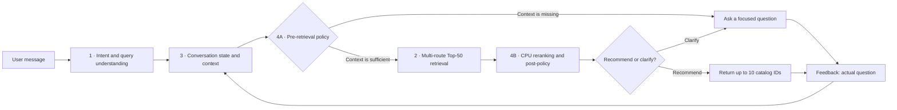

# Shopping Copilot — Stateful Conversational Product Search

> An offline shopping agent that remembers changing requirements, knows when to ask a useful question, and searches a frozen catalog of 50,000 products on CPU.

**TikTok TechJam 2026 · Track 4 · Official entry: `from agent import Agent`**

[Run locally](#run-it-locally) · [Read the technical report](docs/submission/TECHNICAL_REPORT.md) · [View the Devpost story](docs/submission/DEVPOST_ABOUT_PROJECT.md) · [Read in Chinese](README_ZH.md) · [Record a demo](#record-a-demo)

> **Public demo video:** the recorded walkthrough is ready locally; add the public YouTube URL here before final submission. Its narration and upload description are in [the video materials](docs/submission/YOUTUBE_DESCRIPTION.md).

## Why Shopping Copilot

A shopper's intent can change faster than a search form can capture it: *“black dress under $50”* can become *“blue instead,”* then *“no budget limit,”* then *“actually, shoes.”* Treating every message as a fresh query loses context; retaining every old preference creates stale constraints.

Shopping Copilot makes that decision process explicit. It distinguishes buying from browsing, turns language into structured state operations, carries forward only valid requirements, and chooses between clarification and recommendation based on both current context and retrieval feedback.

## Public development results

All results below use the **unchanged organizer evaluator**, the frozen 50,000-product catalog, and all **200 public development sessions**.

| Hit@10 | MRR | MTTC | Efficiency | TechnicalScore |
|---:|---:|---:|---:|---:|
| **98.5% (197/200)** | **0.888375** | **3.205** | **0.779500** | **0.914913** |

These are public development-set results, not private-test claims or the overall event score. Compared with the earlier fixed-two-question ranking baseline, the integrated agent preserves Hit@10 and MTTC while improving MRR from `0.884625` to `0.888375`.

## How one request flows through the agent



The submitted profile collects two pieces of evidence before the first retrieval. From turn three onward, the post-retrieval policy is dynamic: candidate quality and user feedback decide whether to recommend or ask one additional question. State updates are versioned, so stale or cross-session handoffs are rejected.

## A real five-turn walkthrough

Run this exact scenario with `python -m submission_tools.demo --scenario dynamic4b --pause`.

| Turn | Shopper message | State / policy decision | Result |
|---:|---|---|---|
| 1 | “I'm looking for Basketball Men, but I'm still exploring.” | 4A collects category evidence | Ask a focused follow-up; retrieval is skipped |
| 2 | “I want breathable mesh.” | 4A collects a preference | Ask a second follow-up; retrieval is skipped |
| 3 | “Prefer blue and under $60.” | State contains category, feature, color, and budget | Retrieve 50 candidates, rerank, recommend Top-10 |
| 4 | “Those options are not quite right yet.” | 4B detects negative feedback | Ask which feature would improve the match |
| 5 | “I want a drawstring closure.” | State adds the new feature and decays older soft preferences | Retrieve, rerank, and recommend again |

This demonstrates the core distinction in our design: 4A prevents premature retrieval, while 4B responds to evidence from an actual candidate pool.

## What is in the submitted agent

The active, reproducible configuration is intentionally lightweight:

- **Intent and state:** explicit set, clear, exclude, and remove-exclusion operations; hard constraints, decaying soft preferences, weak profile hints, asked-question history, and shown-product feedback.
- **Retrieval:** SQLite FTS5/BM25 keyword and category routes plus catalog evidence; a deterministic, recall-compatible Top-50 boundary.
- **Ranking and policy:** locked CPU reciprocal-rank features; at most ten returned IDs; one bounded retry never relaxes hard constraints.
- **Runtime:** Python standard library and SQLite FTS5 only. No GPU, model weights, Dense embeddings, Qwen/LLM inference, paid API, credentials, or external vector database are used by the official entry.

Research code for stricter adaptive retrieval and model-assisted experiments is kept separate from the submitted default and is not presented as an active dependency.

## Run it locally

Reference interpreter: **CPython 3.12.13**. Python 3.10+ and SQLite with FTS5 are required. There are no third-party Python packages to install.

```bash
python3 -m venv .venv
# macOS / Linux:
source .venv/bin/activate
# Windows PowerShell: .venv\Scripts\Activate.ps1

python -m pip install -r requirements.txt
python -m submission_tools.verify --code-only
python -m submission_tools.prepare_data
python -m submission_tools.verify
python -m submission_tools.evaluate --offline-check
```

`prepare_data` downloads the public organizer kit, verifies its pinned SHA-256, and installs it under `competition_kit/`. The source repository and submission ZIP deliberately exclude catalog data, labels, model weights, private sessions, caches, and credentials.

If automatic download is unavailable, download `techjam-participant-kit.zip` from the [official release](https://github.com/TechJam2026/techjam-conversational-search/releases/tag/participant-kit), then run:

```bash
python -m submission_tools.prepare_data --archive /path/to/techjam-participant-kit.zip
```

After setup, the official entry runs offline. The evaluator command blocks socket and DNS access in that process.

<<<<<<< HEAD
## Interactive Web MVP

### Instant fake-catalog demo

To demonstrate the full flow without downloading the organizer's 50K catalog,
use the bundled 15-product fake catalog. It runs the same parser, state,
retrieval, ranking, explanation, selection and audit code as the real MVP.

```powershell
# Complete scripted Chinese case, then print the B/D handoff and audit result
python -m mvp.demo --case dress_zh

# Interactive terminal chat; type /help for controls
python -m mvp.demo

# Existing browser UI backed by the fake catalog
python -m mvp.demo --web --port 8000
# Then open http://127.0.0.1:8000
```

Other scripted cases are `running_shoes` and `commuter_bag`; list them with
`python -m mvp.demo --list-cases`. The default is fully local and consumes zero
model tokens. The demo data is synthetic and is not used by the official entry
or evaluation. See the [Chinese demo guide](docs/DEMO_GUIDE_ZH.md).

The optional product demo wraps the exact offline Agent with a zero-dependency
local web interface. It shows the live conversation state, product cards and a
bounded decision receipt derived from the Agent's real trace. A non-operative
shadow board estimates which candidate-grounded question would reduce the result
set most. The state ledger shows the supporting user turn and an added/updated/
removed diff, while the receipt reports new versus repeated products within the
current intent version. These are diagnostics only: they do not alter the
official submission entry, its question choice, or its ranking.
Up to three products already shown in the current session can be shortlisted.
The selection is validated and stored by the backend but is never fed into the
ranker. `EXPORT HANDOFF` produces a bounded JSON package for B's description
comparison and D's comparison UI: current requirements and evidence, catalog
descriptions, bullet points, product details, match signals, rank and selection
metadata.
`EXPORT HANDOFF` remains a draft operation. `Finalize my selection`, `完成选择`,
or the `FINALIZE` helper creates a `finalized` decision containing the confirming
turn, UTC timestamp and exact selected ASIN order. Any later selection, rejection
or requirement change invalidates that final status instead of silently presenting
an obsolete decision as current. The shortlist exposes this as a visible
`DRAFT` / `✓ FINALIZED` badge and locks the finalize action while the decision is
current. Finalization is included in the audit chain.
Each result card also shows a source-labelled `WHY IT MAY FIT` / `WATCH-OUTS`
summary. It is extractive: requirement matches quote catalog evidence, conflicts
and missing attributes stay visible, and seller claims are not promoted to
independently verified facts. Changing product category clears a stale shortlist.
The same selection flow is available conversationally: commands such as
`Compare #1 and #3`, `Remove the second one`, `Clear shortlist`, and their common
Chinese equivalents are recorded as control turns. They update only session
selection state—no requirement mutation, retrieval, reranking or model call.
The shortlist renders one evidence-backed fit point and one watch-out per item;
an explicit compare/finalize action also renders a backend-sourced comparison
table for price, rating, hard coverage and supported/trade-off/unknown evidence
counts. Lowest/highest badges describe catalog values only and never rerank.
The exported comparison carries the same rows.
Explicit product feedback is also conversational: `I don't like #2`,
`不要第一个`, or the card's `NOT FOR ME` helper records the displayed catalog
ID in versioned state. Later retrieval excludes rejected IDs before ranking—even
when the novelty pool is exhausted. Selecting/keeping that same displayed rank
reverses the rejection, and changing product category clears stale product-level
feedback. The helper only fills the composer; the shopper still sends it.

The offline parser also supports a bounded Chinese shopping vocabulary for the
demo: common product categories, colors, materials, exclusions, USD budgets and
price ranges are mapped to the English catalog vocabulary before retrieval.
Unicode evidence remains quote-gated when a model is enabled. This is not a
general translator. Because the frozen catalog prices are USD, `元`/`人民币`
amounts are deliberately left unparsed rather than silently treated as dollars;
there is currently no exchange-rate tool.
Once a session receives Chinese input, C's presentation layer keeps clarification,
recommendation, failure and selection-control replies in Chinese. The canonical
state and A/B handoff values remain stable English catalog terms.
The live turn audit can be exported from the header as
`show-me-your-agent-<session>.json`. It contains user-visible messages, bounded
receipts and recommendation summaries, never the full candidate pool or hidden
labels. Consecutive turns form an explicitly unsigned SHA-256 chain so edits or
reordering can be detected without implying identity authentication.

Verify an exported file with:

```bash
python -m mvp.audit show-me-your-agent-<session>.json
```

The three “Try a story” scenarios expose their full prompt sequence one turn at
a time. Loading a scripted turn only fills the composer; it never sends a
message without the reviewer pressing Send.

The web demo defaults to the product-facing `adaptive` orchestration: textual
hard constraints are enforced against catalog evidence and category checks use
the catalog taxonomy before any title fallback. Every product has a Match Card
that separates hard-constraint coverage, soft-preference evidence, exclusions
and uncalibrated ranking signals. To reproduce the official leaderboard policy
in the same UI, launch with `--orchestration-mode score_compat`.
Within one product intent, already emitted catalog IDs are removed from the next
adaptive candidate pool. “Show me more” therefore produces a fresh slate when
possible; if the eligible pool is exhausted, the Agent explicitly reports a
safe reuse instead of fabricating or returning an empty page. Switching product
category opens a new novelty scope.

```bash
python -m mvp.server
# Open http://127.0.0.1:8000
# Optional: reproduce the official submission orchestration in the UI
python -m mvp.server --orchestration-mode score_compat
```

Model assistance is opt-in and only supplements deterministic requirement
parsing. Its proposed updates must be grounded in an exact quote from the
current message, cannot overwrite a slot already parsed by rules, and never
recommends or ranks products. Provider failures fall back to the deterministic
pipeline. The UI and audit receipt expose accepted updates, latency and token
usage; credentials are never included.

On an explicit `Compare ...`, `Finalize ...`, or `EXPORT HANDOFF` action, the
same optional provider can draft B-style pros/cons from the selected products'
bounded catalog descriptions, bullet points and details. Every accepted point
must carry an exact quote from that same product; drafts are visibly labelled
and cannot change rank. Identical comparison requests are cached, so exporting
after comparing does not spend the same model tokens twice. In DeepSeek mode,
normal shopper messages and these selected catalog excerpts leave the machine.

```powershell
# Local OpenAI-compatible server (default endpoint: Ollama-style /v1)
python -m mvp.server --model-provider local --model qwen2.5:7b

# DeepSeek cloud: this sends each shopper message to the configured API
$env:DEEPSEEK_API_KEY = "your-key"
python -m mvp.server --model-provider deepseek
```

Use `--model-base-url` and `--model` for another OpenAI-compatible deployment.
Remote plaintext HTTP endpoints are rejected; HTTP is accepted only for
localhost. The default `off` mode makes no model calls and consumes zero model
tokens. The session API, health endpoint, browser composer and audit export all
surface whether the configured endpoint is local or cloud and describe which
payloads may cross that boundary. No `.env` file or API key is stored by this
repository.

Web sessions are intentionally bounded in memory. The default idle TTL is one
hour and the runtime keeps at most 128 sessions, evicting expired/least-recently
used sessions together with their Agent state. Override these for a longer demo:

```powershell
python -m mvp.server --session-ttl 7200 --max-sessions 256
```

The zero-dependency demo HTTP loop is deliberately single-threaded because A's
in-memory SQLite FTS index owns the thread on which it is constructed. This
preserves session/trace correctness and is suitable for a live demo, but it is
not a multi-worker production deployment. `/api/health` reports
`concurrency_mode=single_threaded_sqlite_owner`; moving to concurrent serving
requires A to provide a thread-safe or per-worker retrieval backend first.

If the organizer kit is not installed, the launcher automatically uses the
repository's `retrieval-and-reranking/data/catalog.jsonl`. An explicit catalog
can be selected with `python -m mvp.server --catalog path/to/catalog.jsonl`.
Run the lightweight server tests with
`python -m unittest discover -s mvp/tests -v`.

Run a reproducible offline end-to-end check against the real catalog with:

```powershell
python -m mvp.smoke
```

It executes a Chinese requirement turn, bounded Top 10 retrieval, two-product
selection, comparison, explicit finalization, same-category requirement-change
invalidation and audit-chain verification. It fails if the default offline path
consumes any model tokens.

For one target-blind acceptance run across all four ownership layers, use:

```powershell
python -m submission_tools.abcd_evaluate --product-sessions 12
```

This first runs the unchanged organizer evaluator over all 200 public sessions
(A), then uses a scenario-balanced public subset to exercise catalog-grounded
evidence (B), multi-turn state/traces/controls/audit lifecycle (C), and cards,
lazy detail, comparison and explicit finalization (D). Ground-truth IDs stay in
the evaluator/simulator and are never passed to the Agent runtime. The default
report is `results/abcd-public.json`; `--skip-official` provides a faster B/C/D
regression while developing presentation code.

The local HTTP surface is deliberately small: `POST /api/session`,
`POST /api/chat`, `POST /api/product`, `POST /api/select`, `POST /api/handoff`,
`POST /api/audit`, and `GET /api/health`. Product detail is lazy, bounded to
catalog IDs already shown in that session, and never invokes retrieval or a
model.

## Official API
=======
### Use the official API
>>>>>>> d9462695f51bb00ca28afcb02056ee022f22cd8a

```python
from agent import Agent

agent = Agent()
agent.reset("example", {
    "purchase_frequency": "unspecified",
    "average_prior_rating": None,
    "rating_style": "unspecified",
    "preference_tags": ["comfort"],
    "summary": "Comfort is a weak preference.",
})
response = agent.respond("example", "I need a black dress under $50.", 1, 10)
```

Each response contains `message`, `ask_attribute`, ordered `recommendations` with `parent_asin` values, and nonnegative `usage`. The Agent enforces sequential turn order and the ten-turn maximum. Judge-provided catalogs can be supplied with `Agent(catalog_path=...)` or `SHOPPING_CATALOG_PATH`.

<<<<<<< HEAD
## Architecture

The product-facing session/orchestration boundary and the A/B/D handoff are
specified in [C — Agent and backend integration contract](docs/integration/C_AGENT_BACKEND.md).

```text
User -> Intent -> State -> Pre-retrieval policy (4A)
                            | missing essential context -> Clarify
                            | otherwise -> Retrieval -> Ranking/Post-policy (4B)
                                                        -> Recommend / Clarify
Actual question and shown-product feedback --------------------> State
```

Intent produces explicit set/clear/exclude/remove-exclusion operations. State
accumulates hard constraints, decaying soft preferences, weak profile hints and
question history. Changing a category clears stale product-specific conditions.

The submitted score profile uses two pre-retrieval evidence-collection turns;
4A chooses the question content from current State. From turn three onward,
candidate quality and feedback drive dynamic recommend/clarify decisions. The
resulting State feeds module 2's deterministic keyword, category and
catalog-evidence routes. Its recall-compatible Top-50 contract
protects candidate coverage before the locked CPU reranker returns up to ten.
The alternative `adaptive` profile uses stricter lexical hard checks, dynamic
route weights and variable candidate counts. Textual checks are lexical evidence,
not verified product-variant attributes.

Two warm-up clarification questions and at most one dynamic post-retrieval
question are allowed as a heuristic, distinct from the organizer's ten-turn
limit. One bounded retry may broaden
retrieval depth and remove soft query terms without relaxing hard constraints.
Versioned results reject stale/cross-session handoffs. Actual questions and
shown products are written back into state; errors do not reuse old candidates.

## Results

All 200 official public development sessions, unchanged organizer evaluator:

| Hit@10 | MRR | MTTC | Efficiency | TechnicalScore |
|---:|---:|---:|---:|---:|
| 197/200 (98.5%) | 0.888375 | 3.205 | 0.779500 | 0.914913 |

These are development-set results, not private-test claims. TechnicalScore is
the evaluator's composite, not the overall judging score. A prior fixed-two-
question locked component baseline had MRR 0.884625, the same MTTC 3.205 and
TechnicalScore 0.913788. The submitted integration preserves the full stateful
chain, raises MRR by 0.003750 and raises the composite by 0.001125 on this public
development set.

That component-4 fixed-question baseline and its one-question variant can be
reproduced with `python scripts/reproduce_question_limit_ablation.py`. The two
public-200 outputs and interpretation are documented in the
[question-limit ablation](docs/integration/QUESTION_LIMIT_ABLATION_2026-09-01.md).
This is a separate RankingAgent experiment, not the submitted adaptive pipeline.

Full sample outcomes, code/data hashes, startup, response latency, memory, tokens
and model costs: [public200.json](docs/submission/public200.json).
Clean-package validation: [reproduction.json](docs/submission/reproduction.json).
Interpretation: [technical report](docs/submission/TECHNICAL_REPORT.md).

```bash
python -m submission_tools.evaluate --offline-check
python -m submission_tools.evaluate --sample-id public_0006 --trace --output results/example.json
# Optional strict/adaptive comparison, separate from the submitted default:
python -m submission_tools.evaluate --orchestration-mode adaptive --ranking-mode locked --output results/adaptive-locked.json
# 46 packaged integration and submission tests, plus 26 web MVP/demo tests:
python -m unittest discover -s shopping_agent/tests -v
python -m unittest discover -s submission_tools/tests -v
python -m unittest discover -s mvp/tests -v
```

Clarification-policy ablations are explicit and do not change the submitted
default unless selected:

```bash
python -m submission_tools.evaluate --clarification-mode fixed_two_dynamic --output results/fixed-two.json
python -m submission_tools.evaluate --clarification-mode one_then_value --output results/one-then-value.json
```

See the [clarification-policy ablation](docs/integration/CLARIFICATION_POLICY_ABLATION_2026-09-01.md).

The runner calls the original evaluator's `evaluate` function with our Agent;
it does not edit the evaluator, labels, simulator or scoring formula. The offline
check blocks socket connections/DNS in that process. Random session IDs and
timings vary; compare sample-level hits, ranks and turns instead of JSON bytes.

## Recordable demo
=======
## Record a demo
>>>>>>> d9462695f51bb00ca28afcb02056ee022f22cd8a

```bash
python -m submission_tools.demo --scenario clarify --pause
python -m submission_tools.demo --scenario override --pause
python -m submission_tools.demo --scenario browse --pause
python -m submission_tools.demo --scenario dynamic4b --pause
```

The terminal trace shows the user message, structured state, 4A decision, retrieval count, 4B decision, response, and feedback. For public recording, add `--delay 4 --ids-only` to hide product titles. See the [Chinese recording plan](docs/submission/YOUTUBE_PLAN_ZH.md), [English upload description](docs/submission/YOUTUBE_DESCRIPTION.md), and [narration script](docs/submission/VIDEO_NARRATION_EN.txt).

## Repository map

<<<<<<< HEAD
- Default: two state-informed evidence-collection turns followed by dynamic 4B,
  module-2 recall-compatible Top-50 retrieval and locked CPU ranking, with output
  capped at 10.
- `--clarification-mode state_evidence` restores the faster accumulated-evidence
  policy used in the ablation.
- Research comparison: `--orchestration-mode adaptive` enables stricter dynamic
  retrieval and hybrid contextual ranking; it is not the submitted default.
- SQLite and evidence indexes run in memory. Catalog size is about 60.5 MB;
  measured process memory is reported separately and includes the evaluator.
- The official entry and default web MVP use zero model tokens and have no model
  API fees. The optional local/DeepSeek requirement helper is outside the scored
  submission; when explicitly enabled, every completed turn reports its actual
  provider token counts. Hardware/electricity costs are not estimated.
- `SHOPPING_CATALOG_PATH` overrides the catalog path. No variables are required
  for a normal run. Legacy hooks `TECHJAM_HARD_PENALTY` (0.20) and
  `TECHJAM_POINTWISE_WEIGHT` (0.35; unused without a model) should remain unset
  for reproduction. Effective values are recorded in the report.
- Parsing is rule-based and supports the tested English patterns; some buying
  messages remain unknown. Complex negation, sizing, variant availability and
  missing prices remain limitations. Ranking scores are not probabilities.
- Category matching can admit false positives: a dress request may match a
  dress shirt, and a shoes request may match unrelated items through the broad
  "Clothing, Shoes & Jewelry" taxonomy. State-change demos do not establish
  that every recommended product meets the requested category.
- The provided profile is a weak prior, not persistent cross-session learning.
  The question budget is heuristic. Dense/LLM semantics and cross-category
  diversity are not claimed by this CPU implementation.
- Next steps: controlled clarification/ranking ablations, better attribute
  extraction, and separately validated semantic extensions with CPU fallback.
=======
| Location | Responsibility | Start here |
|---|---|---|
| [`agent.py`](agent.py) | Official competition entry point | `Agent` |
| [`intent-recognition/`](intent-recognition) | Intent routing and structured query operations | `intent_router/turn_router.py` |
| [`conversation-state-memory/`](conversation-state-memory) | Multi-turn state, overrides, context, and profile hints | `src/state_memory/` |
| [`retrieval-and-reranking/`](retrieval-and-reranking) | Candidate retrieval contracts and routes | `techjam_agent/retrieval.py` |
| [`ranking_pipeline/`](ranking_pipeline) | CPU ranking and policy research/ablations | `agent.py` |
| [`shopping_agent/`](shopping_agent) | Integrated orchestration, 4A, 4B, and response logic | `agent.py` |
| [`submission_tools/`](submission_tools) | Data setup, evaluation, verification, packaging, and demos | `evaluate.py` |
| [`docs/submission/`](docs/submission) | Devpost, video, report, checklist, and reproducibility evidence | `TECHNICAL_REPORT.md` |
>>>>>>> d9462695f51bb00ca28afcb02056ee022f22cd8a

## Documentation and reproducibility

- [Technical report](docs/submission/TECHNICAL_REPORT.md): method, runtime, limitations, and comparable configurations.
- [Public-200 report](docs/submission/public200.json): complete outcomes, hashes, timing, memory, and zero API-cost disclosure.
- [Clean-package validation](docs/submission/reproduction.json): reproduction evidence for the source-only package.
- [Clarification-policy ablation](docs/integration/CLARIFICATION_POLICY_ABLATION_2026-09-01.md): why the submitted profile uses fixed warm-up plus dynamic 4B.
- [Question-limit ablation](docs/integration/QUESTION_LIMIT_ABLATION_2026-09-01.md): comparison with the one-question baseline.
- [Contributions](docs/submission/CONTRIBUTIONS.md): team responsibility allocation.

Useful checks:

```bash
python -m submission_tools.evaluate --offline-check
python -m submission_tools.evaluate --sample-id public_0006 --trace --output results/example.json
python -m unittest discover -s shopping_agent/tests -v
python -m unittest discover -s submission_tools/tests -v
python -m submission_tools.build
```

## Limitations and next steps

The submitted parser is rule-based and optimized for tested English patterns. Complex negation, sizing, variant availability, missing prices, and broad catalog categories remain difficult. A dress query can still admit dress shirts, and textual material or color evidence does not certify a specific variant's availability.

The provided profile is a weak input prior, not persistent learned cross-session memory. Next steps include leaf-category normalization, stronger attribute and negation extraction, better clarification selection, and separately evaluated Dense/LLM extensions with a CPU fallback.

## Data and attribution

The organizer's frozen catalog is derived from [Amazon Reviews 2023](https://amazon-reviews-2023.github.io/), published by the UCSD McAuley Lab. See [DATA_ATTRIBUTION.md](DATA_ATTRIBUTION.md). No product images, private artifacts, or model weights are redistributed here.

## Build a source-only submission

```bash
python -m submission_tools.build
```

This creates `dist/shopping-copilot-submission.zip` and a SHA-256 sidecar. The allowlisted package excludes Git history, catalog data, labels, model weights, private documents, virtual environments, caches, and machine-specific debugger configuration.
