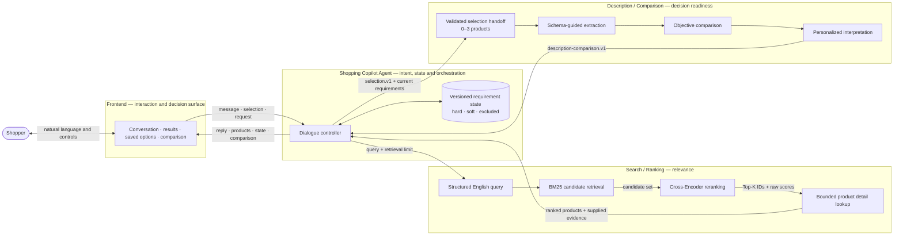
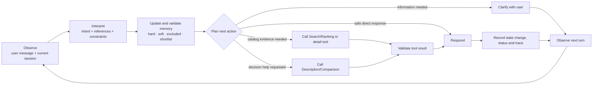
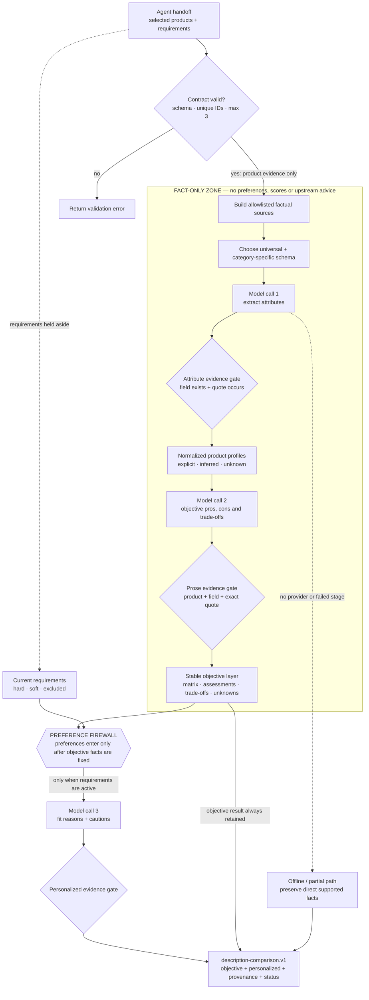

# Shopping Copilot — Technical Document Outline

> **Handoff edition:** Section 5.2 and Appendix E contain the completed Agent
> contribution; Section 5.3 and Appendix D contain the completed
> Description/Comparison contribution, including their cross-cutting sections. Other
> owners fill their modules. Code basis: main `62b6925`. Unmeasured experiments are
> future work; no invented results are required to finish this document.

---

## A. The single story the document must tell

### A.1 Reviewer hook: relevance is not decision readiness

The document should open around one memorable technical thesis:

> **A product can be relevant to a query without being ready for a decision.**

Ordinary search stops after ordering results. This system should be presented as a
pipeline that progressively transforms an ambiguous request into a decision the user
can inspect, correct and understand:

| Transformation | Core question | Responsible module |
|---|---|---|
| Language → structured intent | What does the shopper currently require, prefer or reject? | Agent |
| Catalog → relevant candidates | Which products are most relevant to that intent? | Search/Ranking |
| Evidence → comparable decision factors | How do the user-selected products objectively differ, and which differences matter personally? | Description/Comparison |
| System state → understandable action | Can the shopper see, correct, compare and confirm the decision safely? | Frontend |

This gives the four contributors one shared story. The technical document is therefore
about **closing the gap between retrieval and trustworthy decision support**, not about
placing four technologies next to one another.

### A.2 Claim–mechanism–evidence discipline

Every important paragraph should follow a three-part logic:

```text
Claim: what capability or improvement is achieved?
Mechanism: what implemented design makes it possible?
Evidence: what experiment, trace, metric or failure test supports it?
```

This is the main difference between an impressive technical document and a polished
feature description. A claim without a mechanism sounds like marketing; a mechanism
without evidence sounds unfinished; a metric without a user problem sounds irrelevant.

The document should follow one continuous logic:

```text
Shopping pain point
    → technical requirements
    → system architecture
    → methods used by each module
    → how the modules work together for each user-facing function
    → measurable effects
    → limitations and future improvements
```

The document is **not** four independent progress reports. Every module section must
answer the same six questions:

1. **Problem:** What specific problem does this module solve?
2. **Input:** What exact data does it receive, and from where?
3. **Method:** What algorithm, model, policy or engineering method does it use?
4. **Operation:** How does the method work step by step?
5. **Effect:** What useful result does it produce for the user or next module?
6. **Evidence and boundary:** How was the effect tested, and what can it not guarantee?

This repeated structure makes the four contributions comparable while preserving one
coherent system narrative.

---

## B. Team writing responsibilities

| Module owner | Main responsibility in this document | Must also contribute to |
|---|---|---|
| **Search/Ranking** | Retrieval, reranking, model training and ranking evaluation | Architecture, integration contract, end-to-end evaluation |
| **Shopping Copilot Agent** | Intent understanding, requirement memory, dialogue policy and orchestration | Architecture, API/data flow, end-to-end evaluation |
| **Description/Comparison** | Attribute understanding, objective comparison and personalized comparison | Integration contract, factuality evaluation, limitations |
| **Frontend** | Interaction design, data presentation, API integration and deployment | User journey, usability evaluation, demo screenshots |

One final editor should unify terminology, section order, visual style and claim wording.
Module names—not contributor names—should appear in the final technical narrative.

---

## C. Judging-rubric coverage map

This table is a writing-control tool. It ensures every judging criterion is visible,
evidence-backed and easy to find. It should be removed from the polished submission or
converted into a short document roadmap.

| Judging criterion | Primary document sections | Evidence the reviewer should see |
|---|---|---|
| **1. Goal & Scope Definition** | Executive Summary; Section 3 | Clear user/business value, bounded goal, success criteria and non-goals |
| **2. Architecture & Reasoning Loop** | Sections 4, 5.2 and 6 | Architecture diagram, explicit state/memory, interpret–plan–act–observe loop and one trace |
| **3. Tool Use & Integration** | Sections 5 and 7 | Purpose-fit tool rationale, versioned schemas, validation and end-to-end data flow |
| **4. Autonomy & Human-in-the-Loop** | Sections 3.5, 6 and 9.1 | Autonomy boundaries, clarification/confirmation checkpoints, Undo/Redo and user-selected comparison |
| **5. Safety, Security & Guardrails** | Sections 5.3, 7.2, 9.2 and 9.3 | Prompt-injection boundary, allowlisted evidence, least-privilege access, input/output validation and secret handling |
| **6. Observability & Evaluation** | Sections 8 and 9.4 | Decision trace, status/provenance/latency, golden-path and adversarial cases, claim-matched metrics |
| **7. Platform & Tooling Usage** | Sections 7.4, 9.5 and 10 | Why each framework/tool is appropriate, clean orchestration, reproducible build and deployment |

Do not merely mention a criterion. For each row, show **implemented mechanism + concrete
evidence + honest boundary**.

---

# Proposed document structure

## 1. Title page

Include only:

- project title and one-line technical positioning;
- team name and members;
- challenge/event;
- repository and demo/video links;
- submission date.

**One-line positioning formula:**

> [System name] is a [type of system] that combines [core methods] to help [target user]
> move from [initial problem] to [desired outcome], while [main trust/safety property].

Do not explain implementation details on the title page.

---

## 2. Executive summary

**Goal:** let a reviewer understand the entire technical contribution in under one
minute.

### 2.1 User problem

- What is difficult after ordinary product search?
- Why are many ranked results still insufficient for a purchase decision?
- Why do changing preferences, incomplete catalog data and opaque recommendations
  matter?

### 2.2 Proposed solution

Introduce the four modules in one paragraph, in execution order:

```text
Agent → Search/Ranking → user selection → Description/Comparison → Frontend decision view
```

### 2.3 Main technical contributions

Select the strongest three contributions only. Each must follow:

> **Method → capability → user/system effect**

Examples of contribution types—not final claims:

- hybrid retrieval and reranking;
- reversible conversational requirement state;
- evidence-aware objective and personalized comparison;
- explicit versioned module contracts;
- uncertainty-preserving UI.

### 2.4 Headline results

Insert only final verified results:

- one ranking result;
- one Agent/end-to-end result;
- one Description/Comparison factuality result;
- one Frontend/usability or latency result.

Do not put development metrics, simulated results or future targets here without labels.

---

## 3. Problem formulation and technical requirements

**Goal:** prove that the architecture follows from real user pain points rather than
being a collection of technologies.

### 3.1 Goal, business value and success condition

State the goal in operational terms:

```text
For [target shopper and situation], Shopping Copilot helps [decision task]
by [system capability], so that [measurable user/business value].
```

Then distinguish three levels:

- **Business/user value:** what becomes faster, clearer, safer or more useful?
- **Technical objective:** what must the system do to create that value?
- **Success condition:** which observable metric or task demonstrates improvement?

Avoid generic claims such as “improve shopping experience.” Name the decision bottleneck,
target user action and measurable outcome.

### 3.2 User journey and pain points

Start with one representative scenario:

```text
The user states a broad need
→ refines or corrects preferences
→ examines ranked products
→ saves two or three candidates
→ compares facts and trade-offs
→ makes a decision with uncertainty still visible
```

For each stage, state the failure of a simpler system.

### 3.3 Technical requirements derived from the pain points

Use a compact table:

| Pain point | Technical requirement | Responsible module(s) |
|---|---|---|
| [Too many weakly explained results] | [Relevant retrieval plus explainable evidence] | [Search/Ranking, Agent] |
| [Preferences evolve] | [Persistent and reversible requirement state] | [Agent] |
| [Products are difficult to compare] | [Structured, consistent attribute comparison] | [Description/Comparison] |
| [Advice can mix facts and opinions] | [Separate objective facts from personalization] | [Description/Comparison] |
| [Missing data creates false confidence] | [Unknown and partial states remain visible] | [All modules] |
| [Complex system is hard to use] | [Clear selection and comparison journey] | [Frontend] |

### 3.4 Scope and non-goals

State what the prototype deliberately does not do. This prevents reviewers from
interpreting an omitted feature as an unnoticed failure.

### 3.5 System-level design principles

Introduce four principles here, then use them as cross-references throughout the
document:

1. **User control before automation** — the system may rank, but the shopper chooses
   the comparison set and can correct state.
2. **Facts before preferences** — objective product evidence is established before
   personalized advice is introduced.
3. **Graceful degradation before false certainty** — sparse data or a failed model
   stage produces unknown/partial output rather than invented completeness.
4. **Explicit contracts before hidden coupling** — modules exchange validated,
   versioned data rather than relying on shared implicit assumptions.

Each module owner should identify which principle their method implements and how it is
tested.

---

## 4. Overall system architecture

**Primary owner:** Agent; reviewed by all four module owners.

### 4.1 Component diagram

**Figure 1. End-to-end system architecture and data ownership**



The diagram deliberately assigns a different question to each module: the Shopping
Copilot Agent owns
intent, Search/Ranking owns relevance, Description/Comparison owns evidence-based
decision structure, and the Frontend owns interaction and presentation. Arrow labels
show the actual contract carried between components rather than only control flow.

**Final-design note:** redraw this diagram in the submission's visual style if Mermaid
rendering is unavailable, but preserve its module boundaries, arrow labels and left-to-
right execution order.

### 4.2 End-to-end data flow

Explain one complete request at a high level:

1. user input;
2. requirement interpretation;
3. retrieval and reranking;
4. results and evidence display;
5. user-controlled selection of up to three products;
6. objective and personalized comparison;
7. decision display and confirmation.

Keep this section high-level. Algorithms belong in the module sections.

### 4.3 Reasoning and action loop

The architecture must show how Shopping Copilot moves from observation to a controlled
action instead of presenting the Agent as an unexplained black box.



The Agent owner should annotate one real trace with:

1. current state before the turn;
2. interpreted intent and any ambiguity;
3. selected action/tool and why it was appropriate;
4. validation of the returned result;
5. state and user-visible output after the turn; and
6. the point at which human clarification or confirmation was required.

This section should name the actual planning/control pattern used. Do not claim an open-
ended autonomous planner if the implementation uses a bounded policy and state machine;
bounded reasoning is a strength when it improves predictability and recoverability.

### 4.4 Responsibility boundaries

Use a table with two columns for each module:

| Module | What it owns | What it deliberately does not own |
|---|---|---|
| Agent | [ ] | [ ] |
| Search/Ranking | [ ] | [ ] |
| Description/Comparison | [ ] | [ ] |
| Frontend | [ ] | [ ] |

This table should prevent overlapping or contradictory claims.

### 4.5 Design decisions and rejected alternatives

An exceptional document explains not only what was built, but why this design was
chosen over plausible alternatives. Add a concise decision table after the architecture:

| Decision question | Chosen design | Serious alternative | Why chosen | Evidence/trade-off |
|---|---|---|---|---|
| How should candidates be found and ordered? | [ ] | [ ] | [ ] | [ ] |
| How should conversation state be maintained? | [ ] | [ ] | [ ] | [ ] |
| Who chooses the products to compare? | [ ] | [ ] | [ ] | [ ] |
| How should facts and preferences interact? | [ ] | [ ] | [ ] | [ ] |
| How should modules exchange results? | [ ] | [ ] | [ ] | [ ] |
| What should happen when data or a model stage is missing? | [ ] | [ ] | [ ] | [ ] |

Include only decisions that materially change correctness, latency, user control or
explainability. Avoid weak comparisons against obviously unreasonable alternatives.

---

## 5. Technical methods by module

Every subsection must follow **Problem → Input → Method → Operation → Output → Effect →
Evidence → Limitation**.

### 5.1 Search and Ranking

**Owner:** Search/Ranking.

#### 5.1.1 Problem and design choice

- What retrieval/ranking problem is solved?
- Why is a simple keyword search insufficient?
- Why is a two-stage design appropriate for the available catalog and compute?

#### 5.1.2 Input and product representation

- dataset and locale;
- query fields;
- product fields used in indexing and model input;
- label definition and relevance gains;
- missing or excluded product fields.

#### 5.1.3 Candidate retrieval method

Explain:

- BM25 index construction;
- tokenization and candidate generation;
- candidate-set size;
- why retrieval is efficient;
- which relevant products may still be missed.

#### 5.1.4 Neural reranking method

Explain:

- model type and base model;
- query–product pair construction;
- scoring and final ordering;
- training loss, split, hyperparameters and hardware;
- why raw model scores are not probabilities.

#### 5.1.5 Runtime output and downstream effect

State exactly what is returned to the Agent:

- product identifiers;
- ordering and relevance scores;
- available detail fields;
- unavailable fields;
- resulting benefit for the user.

#### 5.1.6 Evaluation

Include:

- baseline comparison;
- title-only versus title-plus-bullet ablation;
- held-out nDCG/MRR/MAP/Recall;
- CPU/GPU latency;
- representative success and failure examples.

Conclude with one evidence-backed sentence in this form:

> Using [method] improved [metric/capability] from [baseline] to [result] on [split],
> while [remaining limitation].

---

### 5.2 Shopping Copilot Agent and orchestration

**Owner:** Agent.

#### 5.2.1 Problem and state model

The Agent turns a sequence of shopping messages into a consistent, revisable decision
process. A relevant result list alone cannot interpret “blue instead,” retain a saved
product after the list changes, or distinguish a product question from a new preference.
The Agent therefore maintains explicit state and selects the next permitted action from
that state. Its contribution is continuity and controlled execution, rather than an
unrestricted model that decides every action from the conversation transcript.

The implementation separates two responsibilities. `FinalAgent` in
`shopping_agent/agent.py` coordinates intent interpretation, structured memory,
pre-retrieval policy, retrieval/ranking and post-retrieval policy. `AgentRuntime` in
`mvp/server.py` adds the user-facing session lifecycle, product-reference handling,
shortlist, comparison handoff, finalization and HTTP responses.

| State group | Representation and purpose |
|---|---|
| Hard requirements | Explicit necessary conditions, such as category or a strict budget; unsupported evidence must not become a verified match |
| Soft preferences | Weighted acceptable choices that may influence ordering without excluding every alternative |
| Exclusions and product feedback | Rejected attribute values and stable product IDs; hiding an item is distinct from removing it from the shortlist |
| Conversation context | Pending clarification, displayed IDs, browsing/guidance mode and deferred category details |
| Decision context | Saved product records, comparison scope and finalization status |
| History and provenance | Source turns, requirement evidence, state versions and snapshots used by correction and Undo/Redo |

For example, “I prefer cotton, but polyester is okay” keeps a first choice and fallback;
it is not equivalent to a cotton-only requirement. Product IDs retain identity while
display ranks change. Category-specific details can be deferred, but the current
search explores one category at a time. The web service stores sessions in memory with
defaults of 128 sessions and a 3,600-second idle lifetime. These limits do not establish
concurrent-user capacity, durable storage or account-wide personalization.

#### 5.2.2 Intent and requirement processing

Each turn begins with the message and current session context. The runtime distinguishes
read-only questions and conversational controls from requirement changes. The intent
router and structured memory manager interpret supported operations, apply corrections
and export the resulting requirements with a session ID, turn and state version.
Source text and source turns support an inspectable account of what changed.

Compound requests retain separately stated constraints. Category changes replace the
active search context; deferred details remain associated with their intended category.
If multiple categories need disambiguation, the Agent asks which to explore first rather
than implying that both were searched. An explicit correction takes precedence over
the earlier value. Tentative preferences remain distinguishable from firm requirements.

Displayed references are resolved before a combined edit can refresh the results.
Consequently, “How much is #2? I prefer cotton” refers to the second item the shopper
was actually viewing. Invalid or ambiguous references trigger a bounded clarification.
Some ambiguous comparison requests defer the accompanying edit until valid references
arrive; the pending edit is not presented as an already saved preference.

Rules and explicit state operations provide the default interpretation path. An optional
`requirement_enhancer` can propose structured assistance through the configured provider;
it does not replace the runtime's control and validation boundaries. Model assistance
is off by default. Coverage is limited to the implemented language patterns and tested
cases, not arbitrary natural-language understanding.

#### 5.2.3 Dialogue and control policy

The planning pattern is a bounded, stateful policy loop. Pre-retrieval policy determines
whether the current context calls for clarification, retrieval or acknowledgement.
Post-retrieval policy inspects returned candidates and decides whether an evidence-backed
follow-up would help. Control paths can answer directly without entering search.

| Situation | Implemented policy | User-visible effect |
|---|---|---|
| Optional refinement | Use catalog-supported distinctions and estimated candidate reduction, with an attention budget | Ask a useful question alongside results rather than enforce a fixed questionnaire |
| Browsing or “show me first” | Respect the request to see results and dismiss optional narrowing where appropriate | Exploration can continue without inventing a preference |
| Missing category or unverifiable strict budget | Request the necessary choice or explain the evidence gap | Skipping an optional question does not silently relax a hard condition |
| Product question | Resolve the displayed or contextual ID and answer from available listing evidence | Keep the current page and distinguish missing data from negative product evidence |
| “Show me more” or rejection | Prefer unseen eligible IDs and honor exclusions | Do not claim repeated results are new when the retrieved pool is exhausted |
| Undo/Redo | Restore the relevant saved state/history, including the applicable result view | Corrections remain reversible without rebuilding the request |
| Failed search or partial comparison | Surface the failure and provide explicit recovery where supported | Avoid an unbounded automatic retry loop |
| Save or finalize | Enforce the three-item shortlist limit and require an explicit finalization command | A comparison or generic acknowledgement is not a purchase authorization |

The Agent can choose useful information-gathering steps within this action set. It
does not place orders, make payments, reserve stock or operate an implemented staff
approval service. A change to requirements or saved selection can invalidate a prior
confirmation, requiring the shopper to review the current decision again.

#### 5.2.4 Orchestration

Search is needed when an active request requires new candidates, including relevant
requirement changes or requests for more options. The `SearchToolAdapter` translates
structured requirements into an English query and calls `search_products(query, top_k)`.
It then requests records through `get_product_details(product_ids)`. The shared tool owns
BM25 retrieval and local model scoring. The adapter validates IDs and finite scores,
checks catalog-supported requirements and exclusions, and applies supported soft
preference ordering. The displayed batch is capped at ten products. Raw search scores
remain relevance values, not probabilities or quality certificates.

Retrieval and ranking contracts carry the session, turn and state version; context
validation rejects stale or cross-session results. Candidate limits, unique IDs and
rank continuity are checked. The current catalog adapter leaves price and ratings
unknown. It cannot certify a strict budget from those records, even when textual
relevance is high.

Read-only product questions and preference recaps reuse session/catalog context instead
of launching a fresh search. Comparison is a separate branch: the runtime resolves the
exact requested IDs and order, or uses saved IDs when the shopper requests saved options.
The description adapter builds `show-me-your-agent.selection.v1`, including current
requirements and bounded product sources, and invokes the module described in Section
5.3. Comparison does not rerank the search list. An explicit comparison group and the
saved shortlist are separate concepts; finalization and export refer to saved options.

The runtime caches comparison results by product identity/order, requirements, supplied
catalog facts and provider identity. Changed inputs invalidate reuse. Repeated completed
comparisons, export and finalization can reuse available output; explicit retry can
replace a partial result. Retry retains resolved product IDs rather than interpreting
old screen ranks against a newer page. Cache hits avoid additional comparison model
calls, but are not evidence of lower end-to-end latency across an unmeasured workload.

#### 5.2.5 Output and effect

The chat response gives the Frontend an assistant message, ordered products, a receipt
describing requirements and decisions, selection state and, when applicable, a comparison
handoff. Receipts expose such fields as `hard`, `soft`, `excluded`, `state_version`,
requirement evidence, policy reasons, suggested replies, result counts and model usage.
The comparison result is attached under `comparison_assist`; the Frontend determines
which returned fields are visible in its decision view.

The effect is a continuous, inspectable shopping session: the user can revise needs,
inspect the same product, retain saved candidates and request a comparison without
restating the whole task. Stable identity, explicit edits and confirmation boundaries
prevent several tested forms of unintended state change. This establishes functional
continuity; reductions in shopper effort, abandonment or staff workload still require
user studies and a measured baseline.

#### 5.2.6 Evaluation

On 28 September 2026, the isolated workflow regression suite passed **599 tests** on
commit `62b6925`. These include synthetic catalogs and simulated model responses; the
count is a software regression result, not a held-out language accuracy score.

| Capability group | Evidence and checked behavior | Boundary |
|---|---|---|
| State correctness | Requirement, preference-scope, category and budget cases; preserve hard/soft distinctions and applicable evidence | Coverage is limited to the test cases |
| Correction and recovery | Undo/Redo, reset, empty-pool and failed-search cases | Not an unrestricted recovery guarantee |
| Reference stability | Detail follow-ups, invalid ranks and mixed question/edit cases | Numbered references must resolve against a known display |
| Selection consistency | Shortlist, exact comparison scope and confirmation-boundary cases | No transaction system is exercised |
| Model integration | Simulated description success/failure, cache and retry cases | Does not measure live generative quality |
| Real-search lifecycle | `live_smoke --detail-followups` returned ten products, compared two, finalized the shortlist and passed audit checks | Uses the local search index; generative provider was off |

The same real-search run completed a five-turn detail-follow-up scenario, preserving
product IDs and requirements through reference clarification, preference recap and a
care question. Missing care instructions remained unknown. SHA-256 checks confirmed that
all 26 files under the tested `search_tool` directory were unchanged by this run.

A separate local HTTP check through the Vite proxy measured a **52.72-second cold
search**, a **1.21-second warm search**, a **0.39-second comparison** and a **0.04-second
finalization**. These are individual observations on Windows using Miniconda Python,
PyTorch 2.5.1 with CUDA available, and cloud assistance off. Cold initialization exceeded
the React client's 45-second timeout. The measurements are not p50/p95 estimates or
controlled benchmarks; another search verification process was active during the cold
check. Comparison used offline facts, not the three-stage generative pipeline.

**Verified method–effect statement:** explicit session state, bounded policies and
versioned tool handoffs support tested correction, reference continuity and controlled
selection from retrieval through finalization. Broader language robustness, live-model
factuality, production throughput and user-effort improvements remain unmeasured.

---

### 5.3 Description and Comparison

**Owner:** Description/Comparison.

#### 5.3.1 From relevant products to decision-ready evidence

Search relevance and purchase suitability are different problems. A ranking system can
place a blue cotton dress near the top, but it does not automatically organize the
listing into comparable attributes, distinguish stated facts from inference, explain
trade-offs, or identify which differences matter to one shopper. Directly asking a
language model for “the best option” would collapse all of these tasks into one opaque
answer and would encourage unsupported conclusions when catalog information is sparse.

The Description/Comparison module therefore begins **after** retrieval and **after**
user selection. It processes zero to three products already chosen by the shopper and
turns their supplied catalog evidence into two deliberately separate outputs:

1. an **objective comparison** of what the listings support; and
2. a **personalized comparison** of how those supported facts relate to the current
   user's requirements.

The governing invariant is:

> **Facts first, preferences later.** Personalization may interpret an objective fact,
> but it may not rewrite that fact, alter the selected order or silently rerank products.

**Figure 2. Description/Comparison pipeline and preference firewall**



The full requirements payload is absent from the first two model stages. A category
hint is the explicit schema-selection exception. Other preferences enter at
personalization. Evidence gates run on extracted attributes and generated prose;
offline or partial execution preserves direct supported facts rather than manufacturing
missing content.

#### 5.3.2 Contract-first input boundary

The module accepts the Agent's versioned `show-me-your-agent.selection.v1` handoff. The
handoff contains unique product identifiers in the shopper's selected order, bounded
product evidence, and current requirements divided into `hard`, `soft` and `excluded`.
For each product, the factual input may include title, description, bullet points,
scalar detail fields, finite price and finite rating.

The boundary is intentionally narrow. Ranking scores, upstream advice and selection
rationale are not allowed to influence attribute extraction or objective comparison.
The module does not query the catalog, choose products or repair missing source data. It
validates the schema, rejects duplicate or empty IDs, enforces the three-product limit
and preserves the input order in every downstream representation.

This contract makes responsibility explicit: Search/Ranking finds products, the Agent
and user determine the comparison set, and Description/Comparison explains only the
evidence it receives.

#### 5.3.3 Adaptive attribute schema

A single fixed attribute list is too generic to be useful across clothing, shoes,
laptops and headphones, while a completely free-form extraction would make products
difficult to compare consistently. The pipeline therefore combines three layers:

- **universal attributes**, including brand, model, material, colour, size, dimensions,
  price, rating, care and warranty;
- **category-specific attributes**, such as clothing fit and fabric composition, shoe
  cushioning, laptop hardware or headphone connectivity; and
- **additional discovered attributes** when the supplied evidence supports them.

The Agent-provided category is treated as a schema hint rather than evidence that a
specific product belongs to that category. If the hint is absent, the extraction stage
may classify from product text; an unsupported or uncertain category falls back to a
generic schema. The output records whether the schema came from the Agent hint, model
fallback or generic fallback.

This hybrid structure produces a stable comparison vocabulary without forcing every
category into irrelevant fields or presenting a category guess as a product fact.

#### 5.3.4 Evidence-bounded attribute extraction

The first optional model call receives only allowlisted product facts and schema
information. Product text is explicitly treated as untrusted data, never as an
instruction. For every proposed attribute, the model must return:

```text
value + source field + supporting quote + explicit/inferred label
```

The pipeline accepts the attribute only when the cited field exists and the normalized
quote occurs inside that field. Unsupported values are rejected and recorded as
warnings. Direct catalog values for brand, colour, finite price and finite rating remain
available even without a model. Every schema field begins as an explicit unknown, so an
absent value is never converted into a negative product judgement.

The result is a normalized product profile with field-level provenance. This turns
heterogeneous titles, bullets and details into comparable evidence while retaining the
ability to inspect where each value came from.

#### 5.3.5 Objective comparison behind a preference firewall

The second optional model call receives the validated product profiles and factual
sources—but not user requirements, ranking scores, upstream advice or selection
rationale. This **preference firewall** excludes direct preference conditioning, with
the category hint retained for schema selection. Separate live model calls may vary;
payload isolation does not guarantee identical prose across stochastic generations.

The objective result contains:

- a deterministic product-by-attribute matrix assembled from validated profiles;
- evidence-linked pros and cons for each product;
- cross-product trade-offs;
- an explicit list of unknown attributes; and
- `absolute_winner: null`.

Every prose point must cite one or more exact source quotes associated with the correct
product. A missing feature is treated as unknown rather than an inherent disadvantage.

The practical effect is **counterfactual stability**: if only the shopper's preference
changes, the objective comparison should remain unchanged. This gives the Frontend a
stable factual layer instead of a recommendation rewritten to justify the latest wish.

#### 5.3.6 Personalized comparison without hidden reranking

Only after the objective layer has been constructed does the third optional model call
receive the user's hard requirements, soft preferences and exclusions. It produces
evidence-linked `fit_reasons` and `cautions` for each selected product. It is instructed
not to claim satisfaction of an unverifiable budget or other unsupported constraint.

The module sets `ranking_changed: false`, preserves the selected product order and skips
this stage entirely when no user requirements are active. Personalization therefore
answers a different question from objective comparison:

```text
Objective:     How do these products differ according to available evidence?
Personalized:  Which supported differences matter for this user's stated needs?
```

This separation allows the system to be useful without presenting subjective fit as an
objective property of the product.

#### 5.3.7 Structured output for Agent and Frontend

The result uses the versioned `description-comparison.v1` schema:

```text
description-comparison.v1
├── selected product IDs in original order
├── product profiles
│   └── attributes + value + quote + source + evidence type
├── objective comparison
│   ├── comparison matrix
│   ├── per-product assessments
│   ├── trade-offs
│   └── unknowns
├── personalized comparison
│   ├── fit reasons
│   ├── cautions
│   └── ranking_changed = false
├── compatibility projection for the shortlist UI
└── status + warnings + provider/model + token usage + latency + provenance
```

The full structure supports a transparent comparison table, while a simplified
compatibility projection provides up to three evidence-linked pros and cons per product
for the existing shortlist interface. Provider identity, usage and latency make model
execution observable rather than hidden.

#### 5.3.8 Graceful degradation instead of fabricated completeness

The output status communicates what actually happened:

| Status | Meaning |
|---|---|
| `empty` | No products were selected |
| `offline_preview` | No model provider was configured; only direct supported facts are returned |
| `partial` | At least one model stage failed; available validated results are preserved |
| `completed` | All requested model stages returned without a caught error |

`completed` is an execution status, not a certificate of factual correctness. Missing
full descriptions produce a warning and cause the pipeline to use title, bullets and
details instead. A failed model call does not erase already validated evidence. The
integrated Agent can expose an explicit retry rather than entering an automatic retry
loop.

This behavior is important for shopping data, where completeness varies by listing. A
short but supported comparison is safer than a fluent comparison that fills gaps by
guessing.

#### 5.3.9 Validation and current evidence

The committed test suite contains eight focused regression tests with simulated model
responses. It checks:

- separation of the three model stages and exclusion of preferences/ranking data from
  the first two stages;
- rejection of unsupported attributes and fabricated quotes;
- explicit unknown values in offline mode;
- skipping personalization when no requirements are active;
- empty, oversized and duplicate-ID selections;
- contract preservation during provider failure;
- objective invariance when preferences change; and
- generic fallback for an unknown category.

These tests validate control flow, contracts and evidence gating; they do not establish
the semantic quality of a real model. Exact quote occurrence proves that text was copied
from a source, but not that the model interpreted it correctly. Before final submission,
the module should therefore add a small human-labelled evaluation over real selected
products:

| Evaluation question | Proposed measure | Final result |
|---|---|---:|
| Are extracted values supported by the cited field? | Attribute precision | [TO MEASURE] |
| Are objective claims entailed by their quotes? | Claim support rate | [TO MEASURE] |
| Does objective output remain invariant to preference-only changes? | Invariance rate | [TO MEASURE] |
| Does personalization respond correctly to controlled requirement changes? | Consistency rate | [TO MEASURE] |
| Is the comparison useful and complete enough for a decision? | Human usefulness score | [TO MEASURE] |
| What is the live model cost and delay? | Median/p95 latency and token use | [TO MEASURE] |

#### 5.3.10 Method-to-effect summary

| Design method | Immediate technical effect | User-facing value |
|---|---|---|
| Versioned, maximum-three handoff | Stable module boundary and bounded comparison | The user controls exactly what is compared |
| Adaptive attribute schema | Consistent but category-relevant product profiles | Differences are easier to scan |
| Allowlisted sources and quote validation | Unsupported fields and prose are rejected | Claims remain inspectable |
| Preference firewall | Objective facts are independent of user wishes | Advice does not masquerade as fact |
| Separate personalized stage | Requirements affect fit reasons, not factual values | Recommendations are explainable and user-specific |
| Unknown/partial/offline states | Failures and missing data preserve usable evidence | The system degrades honestly rather than guessing |

The final technical claim should be completed only after live evaluation:

> The module converts evidence supplied for up to three user-selected products into a
> stable objective comparison and a separate preference-aware interpretation. Its
> architecture constrains unsupported claims through field-level provenance and quote
> validation; real-model semantic factuality remains to be measured rather than assumed.

---

### 5.4 Frontend and user experience

**Owner:** Frontend.

#### 5.4.1 Problem and design goal

- What decisions must the interface make easier?
- Why are chat alone or a conventional product grid insufficient?
- How should uncertainty and evidence be presented without overwhelming the user?

#### 5.4.2 Information architecture

Explain the roles of:

- conversation and requirement view;
- recommended product list;
- saved-options panel;
- product-detail view;
- comparison view;
- confirmation/finalization state.

#### 5.4.3 Interaction methods

Cover:

- saving no more than three products;
- enabling comparison only with a valid selection;
- evidence and unknown-value presentation;
- original-product link behavior;
- error, timeout and retry handling;
- request serialization and prevention of accidental duplicate actions;
- responsive/mobile behavior and accessibility.

#### 5.4.4 API integration

Explain which backend endpoint supports each user action. Show one sequence diagram
from click/message to updated screen.

#### 5.4.5 Effect and evaluation

Measure:

- completion of search → save → compare → confirm;
- time and error rate;
- clarity of unknown/partial states;
- responsive behavior;
- accessibility and browser compatibility;
- build, unit and browser tests.

Finish with a verified method–effect statement.

---

## 6. How each user-facing function works

**Goal:** connect the module descriptions into visible product functionality. This is
where the document proves that the four pieces form one system.

Use the same mini-template for every function:

```text
User action
→ internal modules involved
→ data/state changes
→ output shown to the user
→ safeguard or failure behavior
```

### 6.1 Start a product search

- user message;
- Agent requirement extraction;
- Search/Ranking query and results;
- Frontend display;
- behavior when nothing relevant is found.

### 6.2 Refine or correct requirements

- hard versus soft change;
- whether search reruns;
- state version update;
- Undo/Redo behavior;
- visible confirmation.

### 6.3 Ask about a displayed product

- product-reference resolution;
- detail lookup;
- evidence-limited response;
- behavior for missing or ambiguous references.

### 6.4 Save, remove or reject products

- selected product ID;
- maximum-three rule;
- difference between shortlist removal and search rejection;
- cache/finalization invalidation;
- Frontend feedback.

### 6.5 Compare selected products

- valid comparison trigger;
- exact selected order;
- Agent handoff;
- Description/Comparison stages;
- Frontend objective and personalized views;
- unknown, partial and retry behavior.

### 6.6 Finalize a selection

- what state is recorded;
- what finalization means;
- what it does not mean;
- what later edits invalidate.

### 6.7 Recover from failures

Cover representative failures across the whole system:

- no lexical match;
- unavailable price;
- invalid item number;
- model stage failure;
- timeout or lost response;
- stale comparison;
- missing product link.

**Recommended figure:** one end-to-end sequence diagram that includes all four modules.

---

## 7. Interface contracts and data integrity

**Primary owner:** Agent; reviewed by all module owners.

### 7.1 Contract overview

Provide a small table:

| Producer | Consumer | Schema/API | Essential fields | Validation/failure rule |
|---|---|---|---|---|
| Frontend | Agent | [ ] | [ ] | [ ] |
| Agent | Search/Ranking | [ ] | [ ] | [ ] |
| Search/Ranking | Agent | [ ] | [ ] | [ ] |
| Agent | Description/Comparison | [ ] | [ ] | [ ] |
| Description/Comparison | Agent/Frontend | [ ] | [ ] | [ ] |

### 7.2 Cross-module invariants

State the rules that must remain true throughout the system:

- stable product identity;
- preserved comparison order;
- no missing price converted to zero;
- no raw ranking score treated as probability;
- no user preferences entering objective comparison;
- no Frontend-created product facts;
- explicit status for empty, partial, offline and completed results.

### 7.3 Caching and invalidation

Explain which outputs can be reused and which changes require recomputation.

### 7.4 Purpose-fit tool and platform rationale

The rubric rewards tool use that is appropriate, not merely numerous. Use one table to
connect every important tool to the job it performs and its operational boundary:

| Tool/platform | Problem it solves | Why it fits better than the main alternative | Input/output contract | Failure/permission boundary |
|---|---|---|---|---|
| [Search retrieval tool] | [ ] | [ ] | [ ] | [ ] |
| [Ranking model] | [ ] | [ ] | [ ] | [ ] |
| [Optional model provider] | [ ] | [ ] | [ ] | [ ] |
| [Agent/runtime framework] | [ ] | [ ] | [ ] | [ ] |
| [Frontend framework] | [ ] | [ ] | [ ] | [ ] |

Emphasize well-typed or validated schemas, narrow tool permissions, predictable failure
handling and clean orchestration. Do not call the system “multi-agent” unless multiple
independent agents actually plan and act. A single Shopping Copilot orchestrating
specialized tools and deterministic modules is a precise and defensible architecture.

---

## 8. Evaluation methodology

**Goal:** evaluate each claim with the correct type of evidence.

### 8.1 Claim-to-metric mapping

| Claim type | Correct evidence | Insufficient evidence |
|---|---|---|
| Ranking quality | Held-out relevance metrics and baselines | Training loss alone |
| Agent correctness | Scenario/state assertions and end-to-end traces | Number of code files |
| Comparison factuality | Human labels and evidence consistency | Valid JSON alone |
| Personalization | Controlled preference changes | One attractive example |
| Frontend usability | Task completion and observed errors | Screenshot alone |
| System efficiency | Measured latency and resource use | “Runs fast” |

### 8.2 Module-level experiments

Each owner supplies:

- research/evaluation question;
- dataset or scenario set;
- baseline;
- metric;
- environment;
- result;
- interpretation;
- failure cases.

### 8.3 End-to-end scenario evaluation

Use a small but diverse scenario matrix covering:

- precise request;
- exploratory request;
- requirement correction;
- missing catalog data;
- saved products across later searches;
- objective versus personalized comparison;
- invalid reference and retry;
- mobile/desktop completion.

### 8.4 Golden-path and adversarial evaluation

Show both ordinary success and deliberate stress. Organize the cases by the guardrail
they test:

| Case type | Example family | Expected safe behavior | Evidence |
|---|---|---|---|
| Golden path | Clear request → relevant results → save → compare → confirm | Complete workflow with correct state and output | [ ] |
| Ambiguous intent | Multiple categories or unclear product reference | Ask a bounded clarification; do not guess | [ ] |
| Missing evidence | Unknown price, rating or description | Surface unknown; do not claim constraint satisfaction | [ ] |
| Prompt injection in product text | Catalog text attempts to instruct the model | Treat text as data; ignore instruction | [ ] |
| Unsupported model claim | Quote or attribute absent from source | Reject claim at evidence gate | [ ] |
| Tool/model failure | Timeout, malformed output or unavailable provider | Preserve validated state; expose partial/retry path | [ ] |
| State attack/error | Duplicate IDs, more than three products, stale reference | Reject or clarify without silent mutation | [ ] |
| User correction | Change requirement, Undo/Redo, remove selection | Apply one auditable change and preserve unrelated state | [ ] |

Adversarial evaluation should target the system's actual trust boundaries rather than
generic jailbreak prompts unrelated to its tools or data.

### 8.5 Ablation and counterfactual tests

High-value experiments include:

- BM25 versus BM25 + reranker;
- title versus title + bullets;
- comparison with versus without category schema;
- objective output before versus after preference change;
- evidence validation enabled versus disabled;
- complete versus sparse product descriptions.

### 8.6 Results presentation

Use no more than:

- one ranking table/plot;
- one capability/e2e table;
- one factuality/consistency table;
- one latency breakdown;
- two carefully selected failure examples.

Every number must state its split, environment and whether it is simulated or live.

### 8.7 Decision-readiness scorecard

Do not compress system quality into one arbitrary “AI score.” Instead, end evaluation
with a multi-axis scorecard showing whether a relevant result has actually become usable
for a decision:

| Decision-readiness axis | Question | Measure | Result |
|---|---|---|---:|
| Relevance | Are suitable products placed near the top? | Held-out ranking metric | [ ] |
| Continuity | Does the system preserve and correctly revise intent? | Scenario success rate | [ ] |
| Comparability | Are selected products represented on consistent attributes? | Coverage + consistency | [ ] |
| Grounding | Are factual claims supported and uncertainty exposed? | Claim support rate | [ ] |
| Personal fit | Does advice change correctly with stated requirements? | Controlled-change consistency | [ ] |
| Actionability | Can users complete search → compare → confirm? | Task completion/time/errors | [ ] |

This scorecard should be the synthesis of earlier experiments, not a new unvalidated
composite metric. It gives reviewers a concise answer to the document's opening thesis:
the system is evaluated not only on whether it retrieves products, but on whether it
prepares a transparent and controllable decision.

---

## 9. Autonomy, security, observability and platform quality

This section should answer four questions: **What may Shopping Copilot do by itself?
When must the user decide? What prevents unsafe tool/model behavior? How can developers
observe and reproduce a decision?**

### 9.1 Risk-calibrated autonomy and Human-in-the-Loop

Use an autonomy matrix rather than calling the system simply “autonomous”:

| Action class | Example | Autonomy level | Human checkpoint | Recovery |
|---|---|---|---|---|
| Low-risk, reversible interpretation | [Parse/update a preference] | [Autonomous after validation] | [Visible state/receipt] | [Undo/Redo] |
| Information retrieval | [Search or detail lookup] | [Tool call within bounded inputs] | [User can refine/reject] | [Retry/change request] |
| Ambiguous intent/reference | [Multiple categories or invalid item number] | [Do not guess] | [Clarification required] | [Cancel/new request] |
| Comparative advice | [Compare selected products] | [Analyze only selected evidence] | [User chooses products and reviews evidence] | [Retry/keep exploring] |
| Consequential action | [Final decision or purchase] | [No autonomous purchase] | [Explicit confirmation; ordering out of scope] | [Edit selection] |

Explain why each boundary is proportionate to risk. Highlight user selection of the
comparison set, clarification, visible unknowns, Undo/Redo and confirmation as designed
control points—not merely interface features.

### 9.2 Safety guardrails and prompt-injection resistance

Map each attack/failure surface to a concrete guardrail and test:

| Surface | Threat | Guardrail | Test evidence |
|---|---|---|---|
| User request | Malformed, oversized or conflicting input | [Validation, bounded clarification] | [ ] |
| Product/catalog text | Text tries to instruct the model | Treat product text as untrusted data; allowlist factual fields | [ ] |
| Model-generated attributes | Unsupported value or source | Field-and-quote evidence gate | [ ] |
| Model-generated prose | Fabricated comparison claim | Product/field/exact-quote references | [ ] |
| Tool output | Unexpected IDs, scores or non-finite values | [Schema and range validation] | [ ] |
| Product URL | Unsafe or malformed external link | [Domain/pattern validation and unverified label] | [ ] |

For Description/Comparison, the prompt explicitly states that product text is data, not
instructions; the pipeline separately validates every accepted attribute and prose
evidence reference. State clearly that this reduces prompt-injection and unsupported-
claim risk but is not a proof of semantic correctness or universal jailbreak immunity.

### 9.3 Least-privilege access and data boundaries

Document the minimum capability granted to each component:

- which module can read catalog fields;
- which module can call retrieval or a model provider;
- which module can mutate session requirements or selection state;
- whether any module has network, filesystem or secret access;
- how API keys are injected and prevented from entering logs or source control;
- why the system cannot place an order or access an account-wide profile.

Use an access matrix if the final implementation has multiple runtime services. Mark
unimplemented least-privilege controls as limitations instead of claiming them.

### 9.4 Observability, tracing and decision audit

Show how one decision can be reconstructed across modules. The trace should include:

```text
request/session ID
→ interpreted intent and state version
→ selected tool and bounded input
→ product IDs/order and warnings
→ comparison status/provenance
→ model/provider, token use and latency where applicable
→ state change and user-visible response
```

Distinguish operational logging, evaluation records and user-facing explanations. If a
hash-linked audit export is used, explain exactly what it detects and what it does not
prove. Include one golden-path trace and one failed/partial trace.

### 9.5 Platform, framework and orchestration quality

Explain platform usage through engineering fit rather than a technology list:

- how the Agent runtime coordinates specialized tools/modules;
- how validated schemas keep integration clean;
- how deterministic policy and optional model assistance are separated;
- how the ranking model/index are loaded and reused;
- how the Frontend consumes the backend contract and serializes mutations;
- how local/static/cloud components are deployed and tested.

Be precise about topology. If Shopping Copilot is one orchestrating Agent plus tools,
say so; do not relabel ordinary modules as independent agents to satisfy a buzzword.
Clean single-agent orchestration can score well when roles, state and contracts are
explicit.

### 9.6 Privacy and external providers

State what data leaves the machine, provider configuration, secret handling, storage,
retention and deletion behavior. Do not list generic “AI ethics” principles. Connect
each safeguard to an implemented behavior and a concrete user risk.

---

## 10. Deployment and reproducibility

### 10.1 Runtime architecture

Show where these components run:

- Python Agent/backend;
- ranking model and index;
- optional generation provider;
- React Frontend/static hosting;
- `/api` routing.

### 10.2 Reproduction procedure

Include only commands tested from a fresh clone:

- dependencies and versions;
- model/index artifact retrieval;
- environment variables;
- backend start;
- frontend build/start;
- test commands;
- smoke scenario.

### 10.3 Performance profile

Break latency into:

```text
Agent processing + retrieval + reranking + description/comparison + network/rendering
```

State hardware and warm/cold conditions.

---

## 11. Limitations and future work

Organize limitations as engineering analysis:

| Current limitation | User/system impact | Current mitigation | Next improvement |
|---|---|---|---|
| [ ] | [ ] | [ ] | [ ] |

At minimum examine:

- sparse catalog fields;
- BM25 recall boundary;
- unverified URLs and live availability;
- bounded category schemas;
- simulated versus live model validation;
- session-only personalization;
- evaluation scale;
- deployment dependencies.

Future work must directly answer the limitations above, not introduce unrelated ideas.

---

## 12. Conclusion

Use three short paragraphs:

1. restate the user problem;
2. summarize how the four-module architecture addresses it;
3. state the strongest verified result and the most important next step.

Do not introduce new features, metrics or claims here.

---

# Required visual set

The final document should contain a small, purposeful visual set:

1. **Problem-to-requirement table** — why each module exists.
2. **End-to-end architecture diagram** — component responsibilities and data flow.
3. **User-function sequence diagram** — how all four modules cooperate.
4. **Search/Ranking pipeline** — BM25, candidates, Cross-Encoder and Top-K.
5. **Agent state diagram** — refinement, correction, comparison and finalization.
6. **Description/Comparison pipeline** — schema, extraction, objective, personalized,
   evidence validation.
7. **Annotated interface screenshot** — requirements, products, saved options and
   comparison.
8. **Evaluation figure/table** — baselines, results and limitations.

Every figure must communicate a relationship that would be harder to understand from
paragraphs alone.

---

# Final consistency checklist

Before submission, one editor should verify:

- [ ] The same product example is used across architecture, module and UI explanations.
- [ ] All modules use the same names and schema terms.
- [ ] Every module explains method **and** effect.
- [ ] Every user-facing function identifies all involved modules.
- [ ] Every metric identifies dataset/split/environment.
- [ ] Simulated tests and live-model results are clearly separated.
- [ ] Development results are not presented as held-out test results.
- [ ] Raw ranking scores are not called probabilities or accuracy.
- [ ] Missing data is not described as a product disadvantage.
- [ ] Description/Comparison never claims to search or rerank products.
- [ ] Frontend screenshots match the final build.
- [ ] Limitations have concrete mitigations and future actions.
- [ ] All bracketed writing instructions have been removed.

---

# Appendix D. Completed comparison contribution for shared sections

**Handoff instructions.** The following text is ready for the final editor to insert
into the indicated sections. Together with Section 5.3, it completes the current
Description/Comparison writing contribution. Agent, Search/Ranking and Frontend owners
remain responsible for their runtime, retrieval, deployment and presentation claims.
No additional numerical results are promised here. Unmeasured experiments in Section
5.3.9 should be labelled future evaluation or omitted from the results table.

## D.1 Executive summary and contribution — Sections 2 and 12

Shopping Copilot separates product comparison into attribute extraction, objective
assessment and personalized interpretation. The first two model stages receive
allowlisted catalog sources, with category used only as a schema hint; the final stage
adds the shopper's requirements. This design makes the input boundary inspectable and
keeps objective and personalized outputs separate. Source-field and quote checks reject
invalid citations, while missing values and model failures are surfaced explicitly.
The implementation provides evidence-linked decision support for up to three selected
products; semantic factuality of live model output has not yet been measured.

## D.2 Ownership and design rationale — Sections 4.4 and 4.5

| Responsibility | Owner |
|---|---|
| Extract attributes, assemble comparison matrix, validate references, generate fit reasons | Description/Comparison |
| Resolve compared IDs, maintain requirements, manage cache/retry, serialize HTTP response | Agent |
| Retrieve candidates and supply available catalog fields | Search/Ranking |
| Render facts, personalized advice, uncertainty and source references | Frontend |

The three-stage design enables stage-specific validation and keeps preferences out of
the objective model request. Compared with a single free-form recommendation call, it
adds sequential model latency and requires the frontend to handle structured output.
Category schemas provide common dimensions while additional supported attributes allow
flexibility. Quote occurrence checking is inexpensive and reproducible, but cannot
replace semantic entailment assessment. These are design trade-offs, not measured
performance improvements over an experimental baseline.

## D.3 Comparison journey and recovery — Sections 6.5–6.7

The Agent resolves the requested or saved product IDs and passes ordered product records
with current requirements. The module validates the handoff, extracts attributes,
constructs the objective result and optionally adds personalized fit reasons. Category
selection prepares extraction: there are up to three model calls, not four models.
Zero products returns `empty`; one can be profiled; two or three can be compared. The
Frontend requirement to save at least two products is a UI rule.

The runtime attaches the dictionary under `comparison_assist`. Failed model calls
produce `partial` and retain available results; the module does not automatically retry.
The Agent integration controls retry, cache and finalization. The module's output is an
analysis result, not a purchase action or final-selection command.

The final Frontend should expose objective and personalized fields separately. In the
inspected React snapshot, the comparison dialog renders the matrix and evidence but
does not render the full personalized output. The Frontend owner must confirm coverage
in the final build; API availability alone does not establish what users can see.

## D.4 Exact interface and provider contract — Section 7

```python
from description_module import DescriptionComparison

result = DescriptionComparison(provider).compare(handoff).to_dict()
```

| Boundary | Contract |
|---|---|
| Input schema | `show-me-your-agent.selection.v1` |
| Product collection | `selected_products`: 0–3 objects with unique, nonempty `parent_asin` |
| Sources | `title`, `product_description`, `product_bullet_points`, scalar `details`, finite numeric `price` and `average_rating` |
| Requirements | Dictionary groups `hard`, `soft`, `excluded`; category hint from `hard.category` |
| Output schema | `description-comparison.v1` |
| Main output | `selected_asins`, `product_profiles`, `objective_comparison`, `personalized_comparison` |
| Compatibility | `products`: up to three objective pros and cons per product |
| Runtime metadata | `status`, `warning`, `provider`, `model`, `usage`, `latency_ms`, `provenance` |
| Invalid input | `ValueError` for checked schema, product count/ID and requirement-type violations |

The provider exposes `name`, `model` and
`complete_json(system=..., user=..., max_tokens=...)`, returning parsed dictionary
`data` and token `usage`. The pipeline requests English generated text and retains source
quotes. `.to_dict()` returns a dictionary; the backend serializes it, without creating
a separate JSON file for every request. `parent_asin` is the Agent-supplied ID; the field
name does not itself establish parent/variant semantics.

The module is stateless between calls. Cache management belongs to the Agent: the
inspected integration keys reuse on IDs/order, requirements, supplied facts and provider
identity. Export/finalization can reuse results; an explicit retry can replace a partial
result. The module does not provide its own HTTP endpoint, dataset lookup or cache.

## D.5 Verified evaluation contribution — Section 8

On 27 September 2026, the eight committed unit tests were rerun successfully against
the exported `main` snapshot `62b6925` using:

```sh
python3 -B -m unittest discover -s description_module/tests -v
```

| Test | Observed result | What it establishes |
|---|---|---|
| Stage separation, evidence and compatibility | Pass | Fixture calls exclude preference/score leakage; unsupported references are rejected |
| Offline explicit unknowns | Pass | Unknown price and absence of personalized generation remain explicit |
| No preferences | Pass | Personalization is skipped and only two fixture calls run |
| Empty selection and size limit | Pass | Empty status and maximum-three validation |
| Duplicate ID | Pass | Duplicate product identifiers are rejected |
| Provider failure | Pass | Partial status preserves product identity and output structure |
| Changed preferences | Pass | Objective output is unchanged with the deterministic fixture provider |
| Unknown category | Pass | Generic schema fallback |

These results concern contract behavior and simulated model responses. They are not
live-model accuracy, usability, latency or prompt-injection success rates. The changed-
preferences test holds the category hint constant and uses a deterministic fixture; it
does not prove exact repeatability of stochastic live generation. Human review of real
model claims, category coverage and latency remains future evaluation.

## D.6 Autonomy, guardrails and observability — Section 9

The module receives a bounded selection and has no exposed action for searching the
catalog, changing session requirements, replacing the shortlist or placing orders.
Generation is available only through an injected provider. This narrow software
interface is not an operating-system sandbox: deployment permissions and network access
remain properties of the Agent/provider environment.

Product text is described as untrusted data in the prompt. Field allowlisting excludes
upstream scores and advice. Each accepted generated attribute or prose point must cite
an existing product field with a quote present after whitespace/case normalization.
These checks reject invalid references; a misleading conclusion with a real quote may
still pass. Prompt-injection resistance is a design intention, not an established
security result, and the semantic correctness of `explicit`/`inferred` labels also
requires review.

The output records stage completion/fallback, exception-type warnings, provider/model,
aggregate token usage and total module latency. These support runtime diagnosis but are
not per-stage timing traces or a billing ledger. Failed calls may incur provider costs
that were not returned to the module. The Agent owns session-level logs and audit export.

The module does not manage API keys or persistent storage. A configured external
provider receives allowlisted product sources and, for personalization, current user
requirements. Provider selection, consent/disclosure, secrets and retention belong to
runtime deployment and must be described by its owner.

## D.7 Runtime and reproduction — Section 10

The module uses Python 3.10+ and standard-library dependencies. It requires the sibling
`description_module` package to be importable from the repository root. Run:

```sh
python3 -B -m description_module.demo
python3 -B -m unittest discover -s description_module/tests -v
```

The demo uses synthetic products without a provider. Calling `DescriptionComparison()`
produces direct-fact `offline_preview`; full generation requires the Agent's configured
provider. There is no separate training job or model checkpoint supplied by this module.
It requests up to 4,096 output tokens per model call, normally makes three calls for a
nonempty selection with active requirements, and two without requirements. The token
ceiling is a request parameter, not a measured cost or guarantee of provider behavior.

## D.8 Limitations and future work — Section 11

| Limitation | Consequence | Present handling / next step |
|---|---|---|
| Sparse or truncated upstream catalog text | Extraction cannot recover omitted evidence | Warning and unknown values; upstream owner can enrich the handoff |
| Quote occurrence is weaker than entailment | Real quotes may accompany unsupported interpretations | Human factuality review; future semantic validation |
| Bounded category schemas | Broad cross-category coverage is unproven | Generic fallback; category-specific evaluation |
| Stochastic provider output | Repeated analyses may differ | Payload separation tested with fixtures; evaluate live consistency |
| Sequential generation | User-visible delay and provider cost | Usage/total latency recorded; Agent-managed cache; measure live performance |
| Partial failures | Some comparison fields remain empty | Preserve available results and label partial; caller-controlled retry |
| Output not fully rendered in inspected React UI | Personalized analysis may not reach the shopper | Frontend owner verifies or completes final field presentation |

## D.9 Final handoff to the other contributors

- **Agent owner:** confirm current handoff, cache/retry, logs and provider configuration;
  fill the Agent section and shared orchestration/deployment facts.
- **Search/Ranking owner:** supply training/evaluation results and confirm available
  product fields; fill the ranking section.
- **Frontend owner:** fill the interface section and verify which comparison outputs
  are visible in the final UI.
- **Final editor:** place D.1–D.8 in their indicated shared sections, retain Section 5.3,
  remove this drafting appendix, and label unmeasured evaluation as future work. Replace
  numerical placeholders with actual evidence or remove them. Do not turn proposed tests
  into claimed results.

The Description/Comparison author has supplied the implementation explanation,
interfaces, available test results, integration boundaries and limitations. Further
changes are needed only if the team's final code or new experimental evidence differs
from the inspected snapshot.

---

# Appendix E. Completed Agent contribution for shared sections

The following contribution complements Section 5.2 and can be incorporated into the
indicated shared sections. It refers to `main` commit `62b6925`; local verification was
performed on 28 September 2026. It does not replace the other owners' module findings.

## E.1 Architecture and design rationale — Sections 4.2–4.5

The runtime owns session identity, current requirements, displayed references and saved
options. Search/Ranking supplies relevance and catalog evidence; Description/Comparison
supplies structured analysis; the Frontend presents those outputs and sends explicit
user actions. This ownership prevents a generated explanation from becoming an implicit
state update or finalization command.

The action loop is interpret–update–plan–act–observe, implemented by explicit policies
and state transitions. It is not an open-ended planner or a collection of independently
acting LLM agents. Read-only controls can bypass retrieval, and candidate observations
can produce an optional clarification for the next user turn.

| Design choice | Alternative considered | Rationale and cost |
|---|---|---|
| Structured requirements with history | Reconstruct requirements from the full transcript on every call | Makes corrections and provenance explicit; requires extraction rules and state maintenance |
| Bounded pre/post-retrieval policies | Let a generative model freely choose all tools | Makes action boundaries testable; language and policy coverage remain bounded |
| Stable product IDs and explicit scope | Resolve every item number against the latest list | Preserves the intended comparison after updates; requires reference and view history |
| Versioned handoffs and adapters | Share mutable objects across modules | Enables context validation and separate module tests; requires schema maintenance |

## E.2 Verified execution example — Sections 4.3 and 6

In the local HTTP check, a newly created session received “I need a blue cotton dress.”
The runtime interpreted the request, retrieved from the real local search index and
returned ten products. The returned message acknowledged a blue-dress search. This
response alone does not prove that every requested attribute had verified evidence;
the accompanying requirements and product evidence must be inspected for that claim.

“Compare #1 and #2” resolved the displayed IDs, compared exactly those two products and
saved them to the shortlist in this scenario. The response reported
`ready_for_comparison` with two selections. “Finalize my selection” then changed the
selection state to `finalized`. The explicit final user turn is the decision checkpoint;
neither retrieval nor comparison represented an order. The separate committed live smoke
test checked audit validity and a five-turn read-only detail-follow-up journey.

The example illustrates the complete sequence and its control boundary. Regression
fixtures provide broader evidence for corrections, invalid references, Undo/Redo and
partial failure; those behaviors should not be described as observations from this
short HTTP sequence.

## E.3 Runtime contracts and cache ownership — Section 7

| Boundary | Payload or invariant |
|---|---|
| Frontend to runtime | Session-scoped chat, product, selection and handoff requests through JSON APIs |
| Memory to retrieval | Structured state with session ID, turn and state version |
| Retrieval and ranking | `RetrievalResultV2` and `RankingResultV2`; validated IDs, limits, ranks and matching context |
| Runtime to comparison | `show-me-your-agent.selection.v1`; ordered product records and `hard`, `soft`, `excluded` requirements |
| Comparison to runtime | `description-comparison.v1` attached under `comparison_assist` |
| Runtime to Frontend | Message, products, receipt, selection state and optional handoff |
| Runtime audit export | `show-me-your-agent.audit.v1`; sequential records with an unsigned SHA-256 chain |

The runtime owns comparison cache keys and invalidation, while the comparison module is
stateless between calls. Schema/context validation reduces stale-result mistakes; it
does not replace authentication or session ownership checks in a public deployment.

## E.4 Human control and observability — Section 9

The Agent autonomously retrieves, checks available evidence and proposes bounded
clarification. The user supplies uncertain choices, controls saved products and
explicitly finalizes. Unverifiable hard constraints are surfaced rather than silently
removed. The available tools expose no payment, ordering or reservation action.
Human staff handoff and production authorization remain future integration work.

Runtime receipts and traces record structured decisions, state evidence, result IDs,
usage and status. They explain executed actions without exposing private model reasoning.
Trace `elapsed_ms` values are elapsed offsets from the turn start, not independent
per-stage durations to sum. The audit chain detects inconsistent records or edits but
is unsigned and can be recomputed; it is not an authenticated, tamper-proof ledger.

Model assistance is selected explicitly through the runtime provider. With a cloud
provider, shopper messages and selected catalog excerpts may leave the machine; the
runtime provides a disclosure. Backend credentials, deployment permissions, retention
and access controls remain operational responsibilities. Catalog text is untrusted
evidence, not authority to change the Agent's instructions. Prompt and quote checks
do not establish immunity to prompt injection or semantic factuality.

## E.5 Reproduction and limitations — Sections 8, 10 and 11

From the repository root, use the configured Python environment:

```sh
python -B -m agentic_workflow.verify
python -B -m agentic_workflow.preflight
python -B -m agentic_workflow.live_smoke --detail-followups
python -B -m agentic_workflow --host 127.0.0.1 --port 8000
```

The first command runs isolated regressions without the real search assets. The next
two require the local index, matching model and search dependencies. The server uses
real search by default; `--demo` explicitly selects synthetic products. Generative
assistance remains off unless a provider is configured. Frontend development uses its
Vite proxy to the local backend. This is local integration, not a production deployment.

The observed cold request exceeded the Frontend timeout, while the warmed request did
not. A deployment should measure cold and warm paths separately and introduce model
preloading with a meaningful readiness check before serving requests. No startup fix
or percentile latency improvement is claimed here. Public service also needs protected
session ownership, shared state, concurrency/load testing and monitored recovery.

The current evidence supports the covered software behaviors and real local retrieval
lifecycle. It does not establish live generative quality, prompt-injection success
rates, retailer-data freshness, production scale or business improvement. Test counts
and single-run timings must retain these labels in the final results table.
